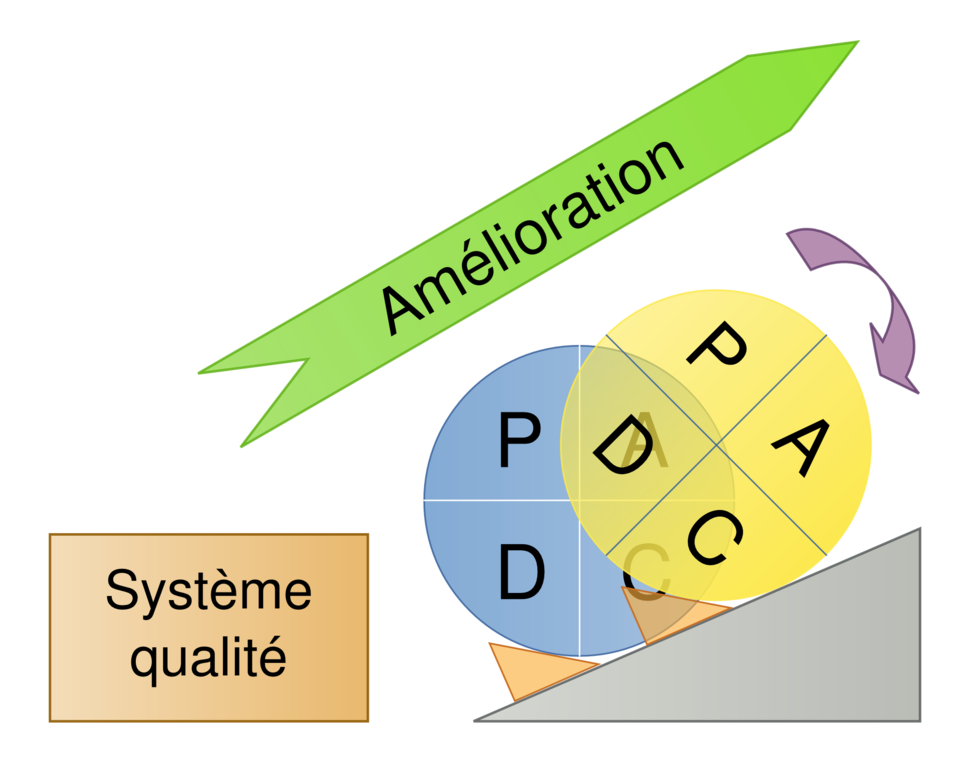
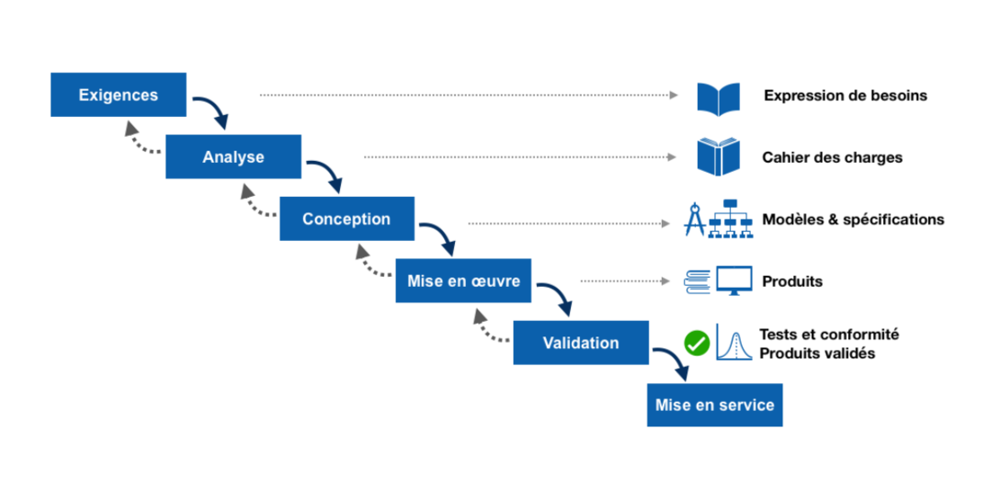

# Comment est née la démarche DevOps

<!-- toc -->

Contrairement à des normes, comme l'ITIL qui ont été commandé par des
organisations ou des gouvernements, le mouvement DevOps est lui issu d'une
succession de conférences, dont les [**DevOpsDays**](https://devopsdays.org/),
qui se sont déroulées à partir de 2008. C'est pour cette raison qu'il n'existe
pas de définition écrite ou de manifeste comme pour les méthodes agiles. Parmi
les noms les plus connus et reconnus, nous retrouvons :

* **Andrew Shafer** organisateur de la première conférence “Agile Infrastructure.”
  en aout 2008 à Toronto. Il n'y eut qu'une seule personne présente Patrick
  Debois.
* **John Allspaw** et **Paul Hammond** qui en Juin 2009 donne une conférence
  intitulé "10 déploiements par jour : coopération Dev et Ops sur Flickr."
* **Patrick Debois** qui est à l'origine du mot DevOps en créant les DevOpsDays.
* **Damon Edwards** et **John Willis** auteur des principes connus sous le nom
  de CAMS ou CALMS.
* **Jez Humble** auteur du livre [_Accelerate_](https://amzn.to/3zR5cyb)
* **Gene Kim** auteur du livre [_The Phoenix Project_](https://amzn.to/3UcOotc)

Le constat qu'ils tiraient est que le cloisonnement des équipes de développement
et des opérations était contre-productif.

## Un peu d'histoire

Revenons en arrière pour comprendre d'où le DevOps tire ses racines. On va
partir loin dans le temps jusqu'au début de l'ère industrielle. Nous allons nous
intéresser aux méthodes d'organisation du travail, puis aux méthodes de gestion
de projets sans trop rentrer dans les détails. Pour le moment cela vous paraitra
étrange, mais au fil de la lecture, vous comprendrez pourquoi certaines méthodes
ont été retenues dans la démarche DevOps au fil de son élaboration.

### Méthodes d'organisation du travail

Dès l'aube de la révolution industrielle, on est au XVIIIe siècle, on a
cherché à améliorer la productivité pour passer de l'artisanat à la production
de masse de biens de consommation.

#### L'organisation Scientifique du Travail

La première fut le _taylorisme_ ou aussi appelé _OST_, organisation scientifique
du travail. Taylor est parti du constat qu'il est impossible de réaliser une
_production de masse_ sans un minimum d'organisation et de discipline. Les
grands principes :

* Le travail complexe est décomposé en tâches élémentaires et hiérarchisées qui
  s'exécutent de manière successive et répétitive
* Chaque titulaire de tâche se voit assigner un poste physiquement fixe (ou
  comportant très peu de déplacements)
* Les objets à produire ou transformés sont rendus mobiles par un procédé de
  convoyage adapté.

Mais, largement critiqué par **Charlie Chaplin** dans **les temps Modernes**
cette méthode de travail montre ses limites par son côté aliénant ayant même des
répercutions sur la santé physique et mentale des opérateurs. Les hommes étaient
devenus des machines où il n'y avait plus de place pour la réflexion. Pourtant,
ces méthodes d'Organisation existent toujours dans certains domaines.

#### Le Toyotisme appelé Lean

Le Lean, _maigre_ en anglais, est une méthode de gestion de production mise au
point au Japon dans les années 50, par Toyota, d'où son nom de Toyotisme. Cette
méthode est axée sur la recherche de la performance que ce soit en termes de
productivité, de qualité, de délais, et de coûts. Son émergence est due au
contexte devenu de plus en plus concurrentiel : car les consommateurs
recherchent avant tout le meilleur rapport qualité/prix.

Le Lean, cette fois fait appel à l'ensemble des employés d'une entreprise pour
identifier puis éliminer toutes les activités non rentables de l'entreprise. Le
Lean cherche donc à supprimer tous les gaspillages, **muda** en japonais :

* La surproduction générant de stocks inutiles et coûteux.
* Les stocks inutiles entre les postes.
* Les goulets d'étranglement donnant des délais d'attente inutiles.
* Les traitements superflus n'apportant pas de valeur ajoutée.
* Les déplacements inutiles pour éviter les pertes de temps.
* Les outils inadaptés faisant baisser la qualité de production.
* Les défauts de fabrication afin d'éviter les retouches et les rebuts.

Cette démarche ne s'arrête jamais, car elle repose sur la notion
**d'amélioration continue**, **kaizen** en japonais, avec la participation de
tous les employés.

Pour répondre à ses objectifs de nombreux outils ont été mis au point. On
retrouve la méthode des 5S, le SMED, le TOM, le PDCA ou aussi appelé roue de
Deming. PCDA pour Plan ➔ Do ➔ Check ➔ Act. Ce cycle reboucle jusqu'à ce qu'une
solution atteigne l'objectif fixé.

Par la suite le Lean a été décliné à d'autres domaines que l'industrie :

* A la gestion des organisations avec le _Lean management_.
* à l'industrie informatique avec le _Lean IT_
* au développement Logiciel avec _Lean software development_
* aux services _Lean Services_
* ...

### La gestion de projets

Les méthodes d'organisation du travail ne s'attachent qu'à la recherche de
l'optimisation de la productivité. Mais quelles méthodes existent pour gérer des
projets ? Petit ou grand. Des projets l'homme en a toujours eu sinon nous ne
serions où nous en sommes actuellement. Pour construire une pyramide, un temple
ou un pont voir une centrale nucléaire, il faut s'organiser sinon on va perdre
du temps voir rencontrer un échec. En effet, il va falloir coordonner un
ensemble d’activités et d’actions dans le but de répondre à un besoin client, et
cela, dans un délai déterminé. Je vais détailler les deux grandes familles de
méthodes de gestion de projets que l'on rencontre dans le domaine du
développement logiciel.

#### Les méthodes traditionnelles

Une méthode "traditionnelle" est composée d'étapes qui se succèdent les
unes après les autres. Par exemple pour le modèle en Cascade :

* **Recueil des exigences du client**.
* **Constitution du cahier des charges fonctionnel** par analyse des exigences du
  client et ajout de celles demandées par des normes.
* **Conception du produit** afin qu'il soit fabriqué en série et remplisse les
  exigences du cahier des charges
* **Pre-Production** : le produit est assemblé et déployé
* **Validation** : le produit est testé afin de voir s'il répond aux exigences
* **Production** : le produit est installé et utilisé.

Chacune de ces étapes ne peut commencer sans que la précédente ne soit terminée,
conduisant à un **effet tunnel**. Il peut se passer de très longues périodes
entre l'expression des besoins du client et la mise en service du produit.

Lors de la livraison, même si le délai est respecté, on constate souvent des
écarts entre les besoins exprimés par le client et le produit livré. De plus,
certaines fonctionnalités se révèlent finalement inutiles alors que d'autres,
découvertes en cours de route, pourraient donner plus de valeur au produit.

#### Les méthodes Agiles

Les méthodologies agiles sont différentes au sens où le développement d'un
produit devient incrémentale et donne une place importante au client tout au
long de ce processus.

Au démarrage du projet, on ne s'attache qu'à déterminer des objectifs à court
terme pour en élaborer une première version. Ensuite en fonction du retour du
client et des résultats des tests, le produit évolue à chaque itération en
cherchant toujours à répondre aux besoins du client.

Les méthodes agiles mettent un point d’honneur à renforcer les relations entre
les membres de l’équipe projet, mais également entre l’équipe et le client.

**Quelques méthodes Agiles** : RAD (rapid application development), Scrum, XP
(eXtreme Programming), ASD (Adaptive software development), FDD (feature driven
development), BDD (Behavior-driven development), Crystal Clear, ... Safe et Less

### Le manifest Agile

En 2001, dix-sept grands noms du développement logiciel se sont réunis pour
tenter d'unifier leurs méthodes respectives. De cette réunion est née le
[**manifest Agile**](https://agilemanifesto.org/iso/fr/manifesto.html). Ce
manifest agile s'appuie sur quatre valeurs et de douze principes fondateurs.

### Les quatre valeurs du Manifest Agile

Les 4 valeurs du manifest Agile :

* Les individus et leurs interactions plus que les processus et les outils
* Des logiciels opérationnels plus qu’une documentation exhaustive
* La collaboration avec les clients plus que la négociation contractuelle
* L’adaptation au changement plus que le suivi d’un plan

Les quatre valeurs du manifeste agile ont été déclinées en douze principes afin
d'aider opérationnellement les équipes qui souhaitaient les suivre.

### Les 12 principes Agile

1. Notre plus haute priorité est de satisfaire le client en livrant rapidement
   et régulièrement des fonctionnalités à grande valeur ajoutée.
2. Accueillez positivement les changements de besoins, même tard dans le projet.
   Les processus Agiles exploitent le changement pour donner un avantage compétitif
   au client.
3. Livrez fréquemment un logiciel opérationnel avec des cycles de quelques
   semaines à quelques mois et une préférence pour les plus courts.
4. Les utilisateurs ou leurs représentants et les développeurs doivent
   travailler ensemble quotidiennement tout au long du projet.
5. Réalisez les projets avec des personnes motivées. Fournissez-leur
   l’environnement et le soutien dont ils ont besoin et faites-leur confiance pour
   atteindre les objectifs fixés.
6. La méthode la plus simple et la plus efficace pour transmettre de
   l’information à l'équipe de développement et à l’intérieur de celle-ci est le
   dialogue en face à face.
7. Un logiciel opérationnel est la principale mesure d’avancement.
8. Les processus Agiles encouragent un rythme de développement soutenable.
   Ensemble, les commanditaires, les développeurs et les utilisateurs devraient
   être capables de maintenir indéfiniment un rythme constant.
9. Une attention continue à l'excellence technique et à une bonne conception
   renforce l’Agilité.
10. La simplicité – c’est-à-dire l’art de minimiser la quantité de travail inutile –
    est essentielle.
11. Les meilleures architectures, spécifications et conceptions émergent d'équipes
    autoorganisées.
12. À intervalles réguliers, l'équipe réfléchit aux moyens de devenir plus efficace,
    puis règle et modifie son comportement en conséquence.

## Pourquoi la démarche DevOps est-elle apparue ?

Maintenant que nous avons vu les différentes méthodes de production et de
gestion de projets attachons à comprendre pourquoi la démarche DevOps est-elle
apparue. Quel problème tente-t-elle de résoudre ?

Il faut se rappeler qu'en 2008, cette date marque les débuts de ce mouvement,
une grande majorité des entreprises était découpé en équipes. Parmi ces équipes
on retrouvait :

* **les développeurs** : en charge d'écrire du code, d'apporter de nouvelles
  fonctionnalités et de corriger des bugs. Leurs préoccupations : apportés le
  plus rapidement des changements pour répondre aux besoins du client.
* **les opérations** : en charge de créer et de maintenir l'infrastructure
  hébergeant ces applications. Leurs préoccupations : stabiliser et garantir la
  disponibilité de celle-ci pour répondre aux exigences du client. Dans les
  opérationnelles, on trouve les personnes en charge de d'administrer, de
  sécuriser et de connecter les équipements.

Nous voyons bien que ces équipes ayant des préoccupations antagonistes ne sont
pas faites pour s'entendre. En effet, les mises en production régulières font
peser un risque sur la stabilité d’une application.

Pour ne pas arranger les choses, les équipes de développement utilisaient de
plus en plus les méthodes agiles augmentant le nombre de mises en production,
alors que celles des "ops" continuaient à travailler en méthode traditionnelle.
De plus ces équipes avaient des budgets et des managers différents et ne
communiquaient que par le biais de demandes de services, _request_ en anglais,
et de changements, _change_ en anglais. Cela conduisait à des incompréhensions,
des allers-retours à répétition, a beaucoup d'incidents, mais surtout à une
faible vélocité.

Dans de telles conditions, un changement devenait nécessaire. Ces deux équipes
devaient se rapprocher et travailler ensemble avec les mêmes objectifs et les
mêmes méthodes.

C'est à travers des conférences dont les DevOpsDays qu'est né cette démarche de
réconciliation. D'ailleurs le mot DevOps s'est imposé lors de l'organisation de
la première d'entre elles par Patrick Debois en 2009 dans la ville de Gand en
Belgique. **Une contraction de Development et Operations pour symboliser leur
rapprochement nécessaire.**

Dans le prochain chapitre, nous verrons sur quelles méthodes et outils reposent
le DevOps.
